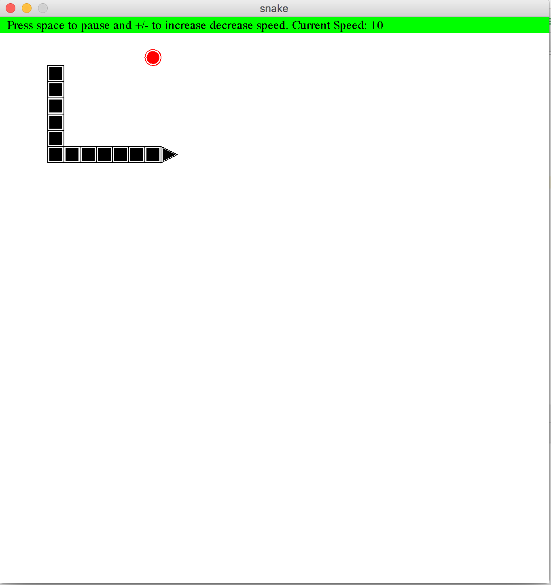

This is a snake game core with all the test cases covered. This can be used in projects where snake game core is needed for example machine learning simulations or to make a full fleged snake game for any platform for which java is supported. A demo JFrame UI is also included, to run this just execute SnakeGUI in package snake.gui

The project is written in a way that the UI is completey decoupled from Core.

Features:
1. Variable Speed.
2. All Cases with 100% test coverage.
3. Best Coding practices with easy to understand code.
4. Play/Pause

